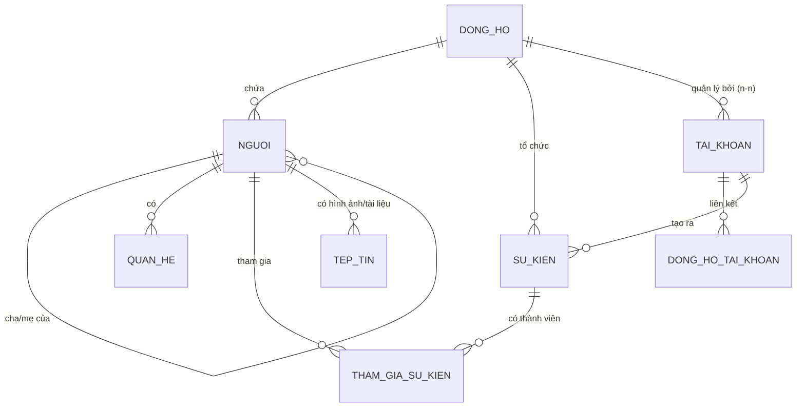

# Thiết kế Database Dự án QLCayGiaPha

Tài liệu này mô tả chi tiết cấu trúc cơ sở dữ liệu của hệ thống Quản lý Cây Gia Phả.

## 1. Sơ đồ Quan hệ (ERD)

## 2. Chi tiết các bảng

### 2.1. `dong_hos` (Dòng họ)
Lưu trữ thông tin về các dòng họ/gia tộc.
- `id`: Khóa chính.
- `ten_dong_ho`: Tên dòng họ (vd: Nguyễn Bá).
- `mo_ta`: Mô tả sơ lược.

### 2.2. `nguois` (Thành viên)
Lưu trữ thông tin chi tiết của từng cá nhân trong dòng họ.
- `id`: Khóa chính.
- `id_dong_ho`: FK -> `dong_hos`.
- `ten_day_du`: Họ và tên.
- `gioi_tinh`: `nam` hoặc `nu`.
- `ngay_sinh`, `ngay_mat`: Ngày sinh và ngày mất (nullable).
- `da_mat`: Trạng thái đã mất (boolean).
- `id_cha`, `id_me`: FK -> `nguois` (quan hệ huyết thống trực tiếp).
- `tieu_su`: Tiểu sử tóm tắt.
- `anh_dai_dien`: Đường dẫn ảnh.

### 2.3. `tai_khoans` (Tài khoản người dùng)
Hệ thống tài khoản để đăng nhập và quản lý dòng họ.
- `id`: Khóa chính.
- `ten`: Tên hiển thị.
- `email`: Email đăng nhập (unique).
- `mat_khau`: Mật khẩu đã mã hóa.
- `vai_tro`: Quyền hạn (`admin`, `thanh_vien`, v.v.).

### 2.4. `dong_ho_tai_khoans` (Phân quyền quản lý)
Bảng trung gian kết nối Tài khoản với Dòng họ.
- `id_dong_ho`: FK -> `dong_hos`.
- `id_tai_khoan`: FK -> `tai_khoans`.
- `vai_tro`: Vai trò trong dòng họ đó (vd: `chu_quan`, `bien_tap`).

### 2.5. `quan_hes` (Quan hệ phi huyết thống/đặc biệt)
Lưu trữ các quan hệ như vợ chồng, nhận nuôi...
- `id_nguoi`: Người thực hiện quan hệ.
- `id_nguoi_lien_quan`: Người bị tác động.
- `loai`: Loại quan hệ (`vo_chong`, `con_nuoi`, v.v.).

### 3. Hệ thống Cache & Thuật toán
- **`bo_nho_quan_hes`**: Lưu trữ kết quả tính toán BFS giữa 2 người để tăng tốc độ hiển thị xưng hô.
    - `id_tu_nguoi`, `id_den_nguoi`: Cặp thành viên cần tra cứu.
    - `ten_quan_he`: Tên xưng hô (vd: "Chú", "Bác").
    - `duong_di`: JSON lưu vết các node trong đồ thị.
